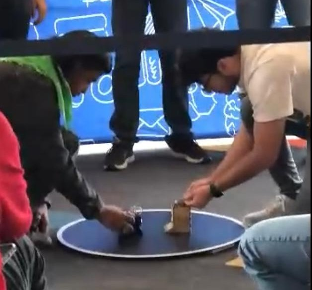

# Yokozuna Robot Challenge (TucZ) - Autonomous Sumo Robot (500g Category)

This repository contains the design documentation and source code for "TucZ", an autonomous sumo robot developed for the Yokozuna Robot Challenge competition in the 500g category.
The Yokozuna Robot Challenge is an international robotics competition inspired by traditional Japanese sumo wrestling. Autonomous robots compete in a circular arena, aiming to push their opponent out of the ring without any human control.

> Learn more about the competition: [Yokozuna Official Site](https://ccrl.notion.site/Acerca-de-706e20c6e6784b24b1a9acb286055106)  

## Project Overview

TucZ is a fully autonomous robot designed to compete in sumo matches by detecting the ring boundary and locating the opponent. The robot integrates infrared (IR) sensors for line detection and ultrasonic sensors for opponent localization equipped with an IR kill switch for safety. The control system is implemented using an Arduino Nano programmed in C++.

Key achievements:
- Successfully programmed offensive and defensive strategies for autonomous combat.
- Qualified to the elimination round (Top 8) among dozens of competitors.

## Repository Structure

***TucZ Set-up during elimination round***

- `yokozunav3.ino`
  - Source code for the Arduino Nano used in the official tournament
- `media/`
  - Photos, videos, and diagrams showcasing the robot build and tests.

## Hardware Description

- Microcontroller: Arduino Nano
- Sensors:
  - Infrared sensors for edge detection
  - Ultrasonic sensors for opponent detection and distance measurement
- Actuators: DC motors with PWM Motor control
- Power source: 9v battery

## Software Description

- Language: C/C++
- Main features:
  - Line detection logic for ring boundary avoidance
  - Opponent tracking using ultrasonic sensor data
  - Autonomous decision-making for offensive and defensive maneuvers

## Future Improvements

- Optimize sensor calibration for varying lighting conditions.
- Refactor code for improved response time and optimized mobility.
- Improve mechanical design for performance on following competitions.

## License

This project is licensed under the MIT License - see the LICENSE file for details.

---

## Collaborators

**Galo Aréchiga Gutiérrez**  
[LinkedIn](https://linkedin.com/in/galo-arechiga-gutierrez-b81b5935b) | galo.arechiga@gmail.com

**Erick Sánchez**  
*(contact information pending)*

**Lorenzo Orrante**  
*(contact information pending)*

